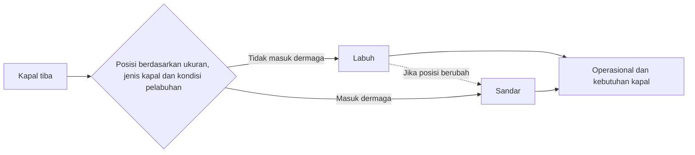
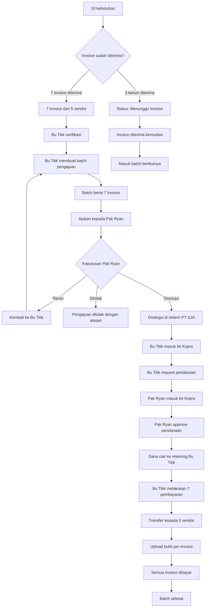
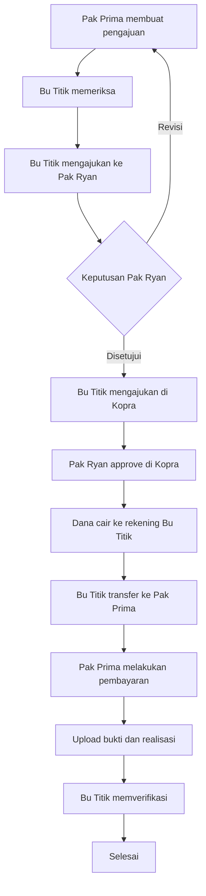
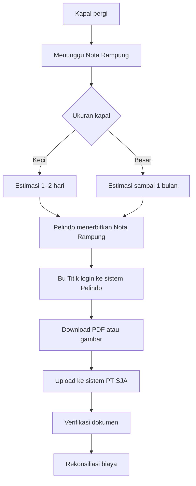

Flow Final Sistem PT SJA

Sistem PT SJA berfungsi sebagai pusat pencatatan dan pengendalian proses keagenan kapal, dari SPK diterima sampai invoice klien dibayar dan kegiatan kapal ditutup.

## Daftar Isi

1. [Role pengguna](#1-role-pengguna)
2. [Flow keseluruhan](#2-flow-keseluruhan)
3. [Pembuatan akun Pak Prima](#3-pembuatan-akun-pak-prima)
4. [Penerimaan dan eksekusi SPK](#4-penerimaan-dan-eksekusi-spk)
5. [Clearance in dan kedatangan kapal](#5-clearance-in-dan-kedatangan-kapal)
6. [Status Labuh dan Sandar](#6-status-labuh-dan-sandar)
7. [Aktivitas harian kapal](#7-aktivitas-harian-kapal)
8. [Kebutuhan kapal](#8-kebutuhan-kapal)
9. [Pemilihan vendor](#9-pemilihan-vendor)
10. [Pemenuhan kebutuhan kapal](#10-pemenuhan-kebutuhan-kapal)
11. [Penerimaan invoice vendor](#11-penerimaan-invoice-vendor)
12. [Batch pengajuan pendanaan](#12-batch-pengajuan-pendanaan)
13. [Status batch pendanaan](#13-status-batch-pendanaan)
14. [Pembayaran invoice vendor](#14-pembayaran-invoice-vendor)
15. [Pengajuan pembayaran melalui Pak Prima](#15-pengajuan-pembayaran-melalui-pak-prima)
16. [Clearance out dan keberangkatan](#16-clearance-out-dan-keberangkatan)
17. [Nota Rampung Pelindo](#17-nota-rampung-pelindo)
18. [Rekonsiliasi biaya](#18-rekonsiliasi-biaya)
19. [Invoice klien](#19-invoice-klien)
20. [Pembayaran klien dan penutupan](#20-pembayaran-klien-dan-penutupan)
21. [Menu sistem](#21-menu-sistem)
22. [Ringkasan inti](#22-ringkasan-inti)

**Beberapa aktivitas tetap dilakukan di luar sistem:**

- Pemilihan dan komunikasi dengan vendor.
- Transaksi melalui Kopra Bank Mandiri.
- Proses clearance dan penerbitan Nota Rampung di sistem Pelindo.
- Aktivitas operasional fisik di kapal/pelabuhan.

Hasil dari aktivitas eksternal tersebut dicatat atau diunggah kembali ke sistem PT SJA.

## 1. Role pengguna

### Owner

**Memiliki akses tertinggi:**

- Melihat seluruh data perusahaan.
- Membuat dan mengelola akun Admin.
- Melihat seluruh SPK dan kegiatan kapal.
- Melihat laporan operasional dan keuangan.
- Melihat audit aktivitas pengguna.
- Mengatur konfigurasi perusahaan.

### Bu Titik — Admin

**Memiliki akses administratif, operasional, dan keuangan:**

- Membuat akun Pak Prima.
- Mengelola pengguna dan hak akses.
- Membuat, menerima, dan mengeksekusi SPK.
- Membuat kegiatan kapal.
- Memperbarui status kapal.
- Membuat kebutuhan kapal seperti Pak Prima.
- Mencatat invoice vendor.
- Membuat batch pengajuan pendanaan.
- Mengajukan pendanaan kepada Pak Ryan.
- Membuat pengajuan di Kopra.
- Mencatat pencairan dana.
- Membayar vendor.
- Mentransfer dana kepada Pak Prima.
- Mengunggah Nota Rampung.
- Membuat laporan realisasi.
- Membuat invoice klien.
- Memantau pembayaran dan piutang.
- Mengelola master data.

### Pak Prima — Operasional

**Memiliki akses operasional:**

- Melihat dan mengeksekusi SPK.
- Membuat kegiatan kapal.
- Mengajukan clearance in dan clearance out.
- Memperbarui posisi kapal.
- Membuat kebutuhan kapal.
- Mencatat aktivitas operasional harian.
- Mencatat pemenuhan kebutuhan.
- Membuat pengajuan dana operasional.
- Mengunggah bukti penggunaan dana.
- Mengunggah dokumen kapal.

**Pak Prima tidak dapat:**

- Mengelola akun pengguna.
- Menyetujui pengajuan sendiri.
- Membuat approval direktur.
- Mengubah transaksi keuangan yang sudah dikunci.
- Menandai invoice vendor sebagai dibayar tanpa verifikasi Admin.

### Pak Ryan — Direktur

**Memiliki akses persetujuan dan monitoring:**

- Melihat seluruh kegiatan kapal.
- Memeriksa pengajuan pendanaan.
- Menyetujui, menolak, atau meminta revisi.
- Memberikan approval kedua di Kopra.
- Melihat realisasi biaya.
- Melihat invoice klien dan piutang.
- Melihat laporan kegiatan harian.

## 2. Flow keseluruhan

```mermaid
flowchart TD
    A[Owner membuat akun Admin] --> B[Bu Titik membuat akun Pak Prima]
    B --> C[SPK diterima dari klien]

    C --> D{Eksekutor SPK}
    D -->|Pak Prima| E[Pak Prima input dan proses SPK]
    D -->|Bu Titik| F[Bu Titik input dan proses SPK]

    E --> G[Buat kegiatan kapal]
    F --> G

    G --> H[Input kapal, klien, pelabuhan, ETA dan dokumen]
    H --> I[Proses Clearance In]
    I --> J[Kapal tiba]

    J --> K{Posisi kapal}
    K -->|Labuh| L[Status: Labuh]
    K -->|Sandar| M[Status: Sandar]

    L --> N[Operasional kapal]
    M --> N

    N --> O[Aktivitas harian bongkar atau muat]
    N --> P{Ada kebutuhan kapal?}

    P -->|Ada| Q[Pak Prima atau Bu Titik membuat kebutuhan]
    P -->|Tidak| R[Lanjutkan kegiatan kapal]

    Q --> S[Vendor dipilih di luar sistem]
    S --> T[Vendor memenuhi kebutuhan]
    T --> U[Menunggu invoice vendor]
    U --> V[Vendor mengirim invoice ke PT SJA]
    V --> W[Bu Titik mencatat dan memeriksa invoice]
    W --> X[Invoice masuk batch pengajuan]
    X --> Y[Approval PT SJA dan proses Kopra]
    Y --> Z[Bu Titik membayar vendor]
    Z --> R

    R --> AA{Kegiatan kapal selesai?}
    AA -->|Belum| N
    AA -->|Sudah| AB[Proses Clearance Out]

    AB --> AC[Kapal pergi dari pelabuhan]
    AC --> AD[Status: Menunggu Nota Rampung]
    AD --> AE[Pelindo menerbitkan Nota Rampung]
    AE --> AF[Bu Titik download dari sistem Pelindo]
    AF --> AG[Upload Nota Rampung ke sistem PT SJA]
    AG --> AH[Rekonsiliasi biaya aktual]
    AH --> AI[Laporan realisasi per kapal]
    AI --> AJ[Invoice klien]
    AJ --> AK[Menunggu pembayaran]
    AK --> AL[Pembayaran diterima]
    AL --> AM[Kegiatan kapal Closed]
```

## 3. Pembuatan akun Pak Prima

Bu Titik sebagai Admin membuat akun Operasional untuk Pak Prima.

**Alur:**

1. Bu Titik membuka menu Manajemen Pengguna.
2. Memilih Tambah Pengguna.
3. Memasukkan data Pak Prima.
4. Memilih role Operasional.
5. Sistem mengirim tautan aktivasi atau kata sandi awal.
6. Pak Prima mengaktifkan akun.
7. Akun berubah menjadi Aktif.

**Data pengguna:**

- Nama.
- Email atau username.
- Nomor telepon.
- Jabatan.
- Role.
- Status akun.
- Tanggal aktivasi.
- Terakhir login.

**Status akun:**

Undangan Dikirim → Belum Aktif → Aktif → Dinonaktifkan

## 4. Penerimaan dan eksekusi SPK

SPK dapat dimasukkan dan dieksekusi oleh Pak Prima maupun Bu Titik.

**Data SPK:**

- Nomor SPK.
- Tanggal SPK.
- Klien/pemilik kapal.
- Nama kapal.
- Jenis dan ukuran kapal.
- Pelabuhan.
- Estimasi kedatangan.
- Jenis kegiatan.
- Dokumen SPK.
- Penanggung jawab.
- Catatan.

**Alur SPK:**

1. SPK diterima dari klien.
2. Pak Prima atau Bu Titik membuat data SPK.
3. Dokumen SPK diunggah.
4. Sistem membuat nomor kegiatan kapal.
5. Eksekutor ditentukan.
6. SPK diaktifkan.
7. Proses clearance in dimulai.

**Status SPK:**

Draft → Aktif → Sedang Diproses → Operasional Selesai → Menunggu Nota Rampung → Penagihan → Closed

## 5. Clearance in dan kedatangan kapal

**Sebelum kapal tiba:**

1. Pak Prima atau Bu Titik menyiapkan clearance in.
2. Biaya dan dokumen clearance dicatat.
3. Jika ada kebutuhan pendanaan, pengajuan dibuat.
4. Proses pembayaran dilakukan melalui mekanisme yang berlaku.
5. Nomor referensi dan bukti pembayaran dicatat.
6. Kapal tiba di area pelabuhan.

Clearance in merupakan tahap administrasi. Sementara Labuh dan Sandar adalah posisi fisik kapal.

## 6. Status Labuh dan Sandar

Labuh dan Sandar adalah dua alternatif posisi kapal. Kapal tidak selalu harus melalui urutan Labuh → Sandar.

**Aturan:**

- Kapal besar dapat tetap berstatus Labuh.
- Kapal yang dapat masuk dermaga berstatus Sandar.
- Aktivitas kapal dapat dilakukan ketika kapal Labuh maupun Sandar.
- Kebutuhan kapal dapat dibuat pada kedua status.
- Invoice vendor dan pendanaan juga dapat berjalan pada kedua status.
- Jika kapal berpindah dari area labuh ke dermaga, status dapat berubah menjadi Sandar.
- Setiap perubahan posisi harus memiliki tanggal, waktu, dan pengguna yang mengubah.

**Status fisik kapal:**

Belum Tiba → Labuh atau Sandar → Berangkat

## 7. Aktivitas harian kapal

Pak Prima mengisi aktivitas setiap kapal selama kegiatan berlangsung. Bu Titik juga dapat mengisi atau mengoreksi apabila diperlukan.

**Informasi aktivitas harian:**

- Tanggal.
- Kapal.
- Posisi Labuh atau Sandar.
- Pelabuhan/lokasi.
- Jenis kegiatan.
- Bongkar atau muat.
- Jumlah muatan.
- Progres.
- Kebutuhan kapal.
- Kendala.
- Rencana berikutnya.
- Lampiran.

Laporan ini digunakan Pak Ryan untuk mengetahui kegiatan lapangan tanpa menunggu laporan melalui grup.

## 8. Kebutuhan kapal

**Kebutuhan kapal dapat dibuat oleh:**

- Pak Prima.
- Bu Titik.

**Data kebutuhan:**

- Nomor kebutuhan.
- Kapal.
- SPK/kegiatan terkait.
- Jenis barang atau jasa.
- Jumlah.
- Satuan.
- Sisa stok, jika ada.
- Tanggal kebutuhan.
- Tingkat urgensi.
- Lampiran permintaan kapal.
- Catatan.

**Kebutuhan utama:**

- Air tawar.
- Perpanjangan sertifikat.
- Pengurusan surat kapal.
- Kebutuhan operasional lainnya.

## 9. Pemilihan vendor

Pemilihan vendor dilakukan di luar sistem PT SJA.

**Pak Prima atau Bu Titik bebas menggunakan vendor mana saja yang:**

- Tersedia.
- Dapat memenuhi kebutuhan.
- Sesuai lokasi kapal.
- Sesuai waktu yang diperlukan.

Sistem tidak menyediakan proses wajib untuk memilih atau menyetujui vendor.

**Vendor hanya dicatat untuk kebutuhan administrasi, terutama ketika:**

- Vendor sudah menerima order.
- Kebutuhan telah dipenuhi.
- Invoice vendor diterima.
- Pembayaran akan dilakukan.

Kolom vendor dapat kosong saat kebutuhan dibuat. Vendor menjadi wajib ketika invoice dicatat.

## 10. Pemenuhan kebutuhan kapal

**Alurnya:**

1. Pak Prima atau Bu Titik mencatat kebutuhan.
2. Vendor dipilih di luar sistem.
3. Vendor dihubungi di luar sistem.
4. Vendor memenuhi kebutuhan kapal.
5. Status kebutuhan menjadi Terpenuhi.
6. Sistem menunggu invoice vendor.
7. Vendor mengirim invoice ke PT SJA.
8. Bu Titik mencatat invoice.
9. Invoice masuk ke proses pendanaan.

**Status kebutuhan:**

Dibuat → Diproses di Luar Sistem → Terpenuhi → Menunggu Invoice → Invoice Diterima → Masuk Pengajuan → Dibayar → Selesai
Pemenuhan kebutuhan dan pembayaran merupakan dua proses berbeda. Vendor dapat memenuhi kebutuhan lebih dahulu dan mengirimkan invoice setelahnya.

## 11. Penerimaan invoice vendor

Invoice vendor diterima oleh PT SJA dan dikelola Bu Titik.

**Data invoice:**

- Nomor invoice.
- Tanggal invoice.
- Tanggal diterima.
- Vendor.
- Kapal.
- SPK.
- Kebutuhan terkait.
- Nominal.
- Pajak jika ada.
- Jatuh tempo.
- Dokumen invoice.
- Status verifikasi.
- Status pembayaran.

**Bu Titik memeriksa:**

- Kesesuaian vendor.
- Kesesuaian kapal.
- Kesesuaian kebutuhan.
- Nominal invoice.
- Barang/jasa yang diberikan.
- Kelengkapan dokumen.
- Kemungkinan invoice ganda.

Hanya invoice valid yang dapat dimasukkan ke pengajuan pendanaan.

## 12. Batch pengajuan pendanaan

Pengajuan Bu Titik kepada Pak Ryan dibuat berdasarkan invoice vendor yang sudah diterima, bukan berdasarkan semua kebutuhan yang pernah dibuat.

**Contoh:**

- Terdapat 10 kebutuhan.
- Baru 7 invoice diterima.
- Tujuh invoice berasal dari 5 vendor.
- Bu Titik membuat pengajuan berisi 7 invoice.
- Tiga kebutuhan lainnya tetap Menunggu Invoice.
- Setelah 3 invoice tersisa diterima, invoice tersebut masuk batch berikutnya.

## 13. Status batch pendanaan

Draft → Menunggu Approval Pak Ryan → Perlu Revisi → Disetujui di SJA → Diajukan ke Kopra → Menunggu Approval Kopra → Disetujui di Kopra → Dana Cair → Pembayaran Vendor → Selesai

**Status tambahan:**

- Ditolak
- Pembayaran Sebagian
- Menunggu Bukti Pembayaran

## 14. Pembayaran invoice vendor

**Setelah dana cair ke rekening Bu Titik:**

1. Sistem menampilkan seluruh invoice dalam batch.
2. Bu Titik melakukan pembayaran per invoice.
3. Jika terdapat 7 invoice, sistem mencatat 7 pembayaran.
4. Beberapa pembayaran dapat dikirim ke vendor yang sama.
5. Bukti transfer diunggah pada masing-masing invoice.
6. Invoice berubah menjadi Dibayar.
7. Batch berubah menjadi Selesai setelah seluruh invoice dibayar.

**Data pembayaran:**

- Invoice.
- Vendor.
- Nominal.
- Tanggal pembayaran.
- Rekening tujuan.
- Nomor referensi.
- Bukti transfer.
- Pengguna yang membayar.
- Status verifikasi.

## 15. Pengajuan pembayaran melalui Pak Prima

**Untuk biaya tertentu seperti pengurusan surat, sertifikat, atau pembayaran operasional lapangan:**

**Jika terdapat sisa dana, Pak Prima wajib mencatat:**

- Nominal aktual.
- Sisa dana.
- Tujuan penggunaan.
- Bukti pembayaran.
- Tanggal transaksi.

## 16. Clearance out dan keberangkatan

**Setelah operasional selesai:**

1. Pak Prima atau Bu Titik memulai clearance out.
2. Dokumen dan pembayaran diselesaikan.
3. Kapal meninggalkan pelabuhan.
4. Status fisik berubah menjadi Berangkat.
5. Status administrasi berubah menjadi Menunggu Nota Rampung.

Kegiatan belum dapat ditutup hanya karena kapal sudah pergi.

## 17. Nota Rampung Pelindo

**Nota Rampung:**

- Dikeluarkan oleh Pelindo.
- Diterbitkan setelah kapal pergi dari pelabuhan.
- Diproses melalui sistem milik Pelindo.
- Dapat diakses oleh Bu Titik.
- Kemungkinan dapat diunduh sebagai PDF atau gambar.
- Harus diunggah kembali ke sistem PT SJA.

**Estimasi terbit:**

- Kapal kecil: sekitar 1–2 hari setelah kapal pergi.
- Kapal besar: dapat mencapai sekitar 1 bulan.

**Data Nota Rampung:**

- Kapal.
- SPK.
- Nomor Nota Rampung.
- Tanggal kapal pergi.
- Tanggal diterbitkan.
- Tanggal diunduh.
- Tanggal diunggah ke sistem SJA.
- Dokumen PDF/gambar.
- Nilai biaya.
- Catatan.
- Status.

**Status Nota Rampung:**

Menunggu Pelindo → Tersedia di Pelindo → Sudah Diunduh → Sudah Diunggah → Terverifikasi

**Sistem memberikan pengingat jika:**

- Kapal kecil melewati dua hari.
- Kapal besar mendekati atau melewati satu bulan.

## 18. Rekonsiliasi biaya

**Setelah Nota Rampung diunggah:**

1. Bu Titik memeriksa seluruh pengeluaran kapal.
2. Biaya awal dibandingkan dengan biaya aktual.
3. Nota Rampung menjadi salah satu dasar realisasi.
4. Jika terdapat kekurangan, dibuat pengajuan tambahan.
5. Jika terdapat dana tidak terpakai, dicatat sebagai sisa.
6. Semua biaya dirangkum per kapal.
7. Laporan realisasi dibuat.

**Komponen realisasi:**

- Clearance in.
- Biaya Labuh atau Sandar.
- Clearance out.
- Biaya Pelindo.
- APBS jika berlaku.
- Kebutuhan kapal.
- Invoice vendor.
- Pengurusan surat dan sertifikat.
- Pembayaran operasional.
- Biaya internal.
- Kekurangan atau sisa dana.
- Total HPP aktual.

## 19. Invoice klien

Setelah rekonsiliasi selesai, Bu Titik membuat invoice klien.

**Jenis invoice:**

**Invoice jasa keagenan**

- Berisi jasa perusahaan.
- Menggunakan harga jual.
- Dapat dikenakan PPh sesuai ketentuan.

**Invoice reimburse**

- Berisi penggantian biaya aktual.
- Berdasarkan biaya yang sudah dikeluarkan.
- Tidak diperlakukan sama dengan invoice jasa.
- Materai diterapkan sesuai ketentuan nominal yang berlaku.

**Alur:**

1. Sistem menghasilkan invoice.
2. Bu Titik memeriksa invoice.
3. Invoice dicetak atau diunduh.
4. Pak Ryan menandatangani jika diperlukan.
5. Materai ditambahkan jika diperlukan.
6. Dokumen final dipindai.
7. Hasil pindai diunggah.
8. Invoice dikirim kepada klien.
9. Status menjadi Menunggu Pembayaran.

## 20. Pembayaran klien dan penutupan

Pembayaran klien masuk ke rekening perusahaan.

**Data yang dicatat:**

- Invoice.
- Tanggal pembayaran.
- Nominal.
- Rekening penerima.
- Nomor referensi.
- Bukti pembayaran.
- Sisa piutang.

**Status invoice klien:**

Draft → Dicetak → Ditandatangani → Dikirim → Menunggu Pembayaran → Jatuh Tempo → Lunas

**Kegiatan kapal dapat ditutup jika:**

- Kapal sudah berangkat.
- Nota Rampung sudah diunggah.
- Rekonsiliasi biaya selesai.
- Seluruh invoice vendor sudah diselesaikan.
- Invoice klien sudah dibuat.
- Pembayaran klien sudah diterima.
- Tidak ada pengajuan terbuka.

**Status akhir:**

Closed

## 21. Menu sistem

**Dashboard**

- Kapal aktif.
- Kapal Labuh.
- Kapal Sandar.
- Kapal sudah berangkat.
- SPK aktif.
- Kebutuhan menunggu invoice.
- Invoice vendor belum diajukan.
- Batch menunggu approval.
- Pendanaan menunggu Kopra.
- Nota Rampung tertunda.
- Invoice klien belum dibayar.
- Total piutang.

**Manajemen Pengguna**

- Akun.
- Role.
- Hak akses.
- Aktivasi dan penonaktifan.

**SPK dan Kegiatan Kapal**

- SPK.
- Detail kapal.
- Clearance.
- Posisi kapal.
- Aktivitas harian.
- Dokumen.

**Kebutuhan Kapal**

- Daftar kebutuhan.
- Status pemenuhan.
- Vendor pencatatan.
- Invoice terkait.

**Invoice Vendor**

- Invoice diterima.
- Verifikasi.
- Menunggu batch.
- Dibayar.

**Pengajuan Pendanaan**

- Batch invoice.
- Approval Pak Ryan.
- Status Kopra.
- Pencairan.
- Pembayaran vendor.

**Nota Rampung**

- Menunggu Pelindo.
- Dokumen diunggah.
- Verifikasi.
- Rekonsiliasi.

**Penagihan**

- Laporan realisasi.
- Invoice jasa.
- Invoice reimburse.
- Piutang.

**Master Data**

- Klien.
- Kapal.
- Pelabuhan.
- Vendor.
- Produk/jasa.
- Satuan.
- Harga HPP.
- Harga jual.
- Jenis dokumen.
- Jenis biaya.

## 22. Ringkasan inti

**Alur final sistem adalah:**

SPK diterima → Pak Prima atau Bu Titik mengeksekusi → kapal tiba → posisi kapal Labuh atau Sandar → kebutuhan kapal dibuat → vendor dipilih di luar sistem → vendor memenuhi kebutuhan → invoice vendor diterima → Bu Titik menggabungkan invoice yang sudah masuk ke dalam batch → Pak Ryan approve di sistem SJA → Bu Titik mengajukan di Kopra → Pak Ryan approve di Kopra → dana cair ke Bu Titik → Bu Titik membayar setiap invoice vendor → kapal menyelesaikan kegiatan dan pergi → Pelindo menerbitkan Nota Rampung → Bu Titik mengunduh dan mengunggahnya ke sistem SJA → rekonsiliasi biaya → invoice klien → pembayaran diterima → kegiatan kapal ditutup.
